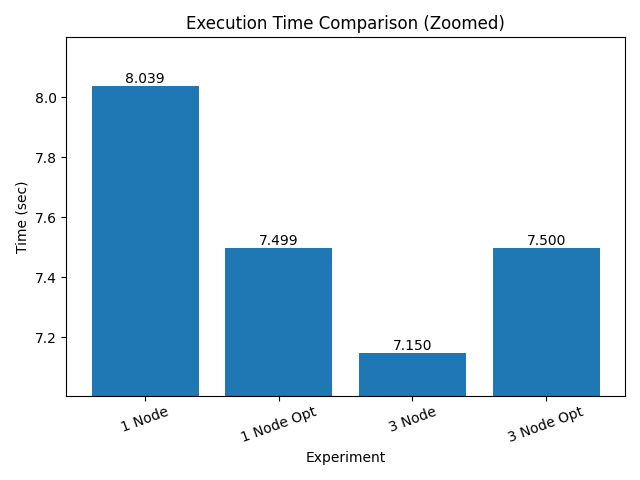
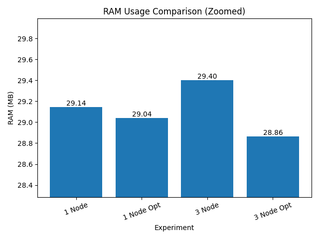
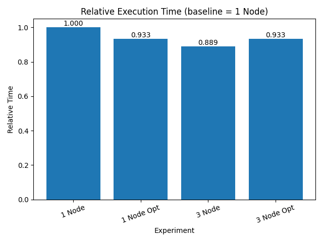
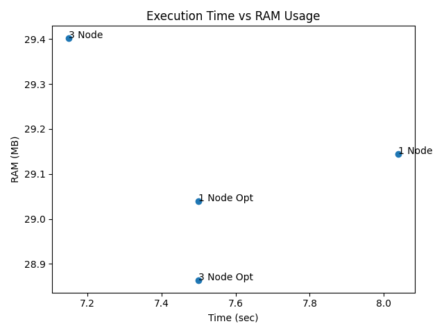

# Spark/Hadoop Laboratory Work

## Project Structure

The project is organized into several directories and files, each responsible for a specific part of the pipeline.


### Description

- `data/stackoverflow_100k.csv`  
  Preprocessed dataset used for Spark analysis.

- `docker-compose.yml`  
  Configuration file for deploying Hadoop (NameNode, DataNode) and Spark (master and worker).

- `hadoop/hdfs_upload.sh`  
  Script for uploading dataset into HDFS.

- `launch_project.sh`  
  Helper script for running the full pipeline.

- `preprocessing/eda.ipynb`  
  Notebook with exploratory data analysis and preprocessing steps.

- `results/`  
  Contains experiment metrics and generated plots.

- `spark_app/app.py`  
  Main Spark application with data processing logic.

- `spark_app/config.py`  
  Configuration parameters for Spark.

- `spark_app/dockerfile`  
  Docker image definition for Spark containers.

- `spark_app/utils.py`  
  Utility functions for logging metrics such as execution time and RAM usage.

---

## Running the Project

### Start Docker Containers
Change `--scale datanode` parameter to modify number of nodes, `=3` for our experiments
```
docker compose -f docker-compose.yml up -d --build --scale datanode=1
```
### Upload Data to HDFS
```
bash hadoop/hdfs_upload.sh
```
### Run Spark Application
```
docker exec -it spark-master spark-submit /app/app.py
```

---
## Changing Number of Partitions
To modify the number of partitions, update the following lines in `app.py` \
Uncomment and adjust the value inside `repartition(N)` to control parallelism.
```
# === OPTIMIZATION ===
df = df.repartition(6)
df.cache()

# прогрев кеша
df.count()
```

---
## Dataset Description
The dataset contains **StackOverflow survey data** with more than 100,000 rows and multiple feature types.

### Schema
```
root
|-- Country: string (nullable = true) 
|-- YearsCode: string (nullable = true)
|-- DevType: string (nullable = true)
|-- LanguageHaveWorkedWith: string (nullable = true)
|-- ConvertedCompYearly: double (nullable = true)
|-- RemoteWork: string (nullable = true)
```


### General Information

| Metric       | Value   |
|-------------|--------|
| Rows        | 109184 |
| Partitions  | 6      |

---

## Spark Transformations

### Developers by Country

| Country                  | Count |
|--------------------------|------|
| United States of America | 24239 |
| Ghana                    | 112   |
| United Kingdom           | 6736  |
| South Africa             | 690   |
| Norway                   | 883   |
| Israel                   | 1123  |
| Iran                     | 718   |
| Austria                  | 1261  |
| Nepal                    | 260   |
| UAE                      | 215   |

---

### Average Salary by Country

| Country                  | Avg Salary |
|--------------------------|-----------|
| Mali                     | 5260625.71 |
| Thailand                 | 287216.58  |
| South Africa             | 272236.36  |
| Ethiopia                 | 220716.08  |
| Afghanistan              | 175848.85  |
| Nomadic                  | 160871.96  |
| United States of America | 132188.74  |
| Canada                   | 128571.73  |
| Australia                | 124614.41  |
| Djibouti                 | 110516.50  |

---

### Remote Work Distribution

| Remote Work Type | Count |
|------------------|------|
| In-person        | 14774 |
| Hybrid           | 56934 |
| Remote           | 37476 |

---

## Experiments

### Metrics

| Experiment                 | Time (sec) | RAM (MB) | Partitions |
|----------------------------|-----------|---------|-----------|
| 1 Node, Spark              | 8.039     | 29.14   | 2         |
| 1 Node, Spark Opt          | 7.499     | 29.04   | 6         |
| 3 Node, Spark              | 7.324     | 28.98   | 6         |
| 3 Node, Spark Opt          | 7.499     | 28.86   | 6         |

---

## Plots

### Execution Time



### RAM Usage



### Relative Time



### Time vs RAM



---

## Analysis

### Execution Time

- Optimization on a single node reduced execution time from 8.039 to 7.499 seconds.
- Using three DataNodes further improved performance to approximately 7.15 seconds.
- Combining optimization with multiple nodes did not improve performance further.

### RAM Usage

- Memory usage remained stable across experiments, around 29 MB.
- Slight decrease observed in optimized multi-node setup.

### Relative Time

- Best performance achieved with 3 DataNodes without additional optimization.
- Optimization provides benefit mainly in single-node setup.

### Time vs RAM

- Multi-node configuration shifts execution time lower without increasing RAM significantly.
- Optimized runs cluster closer together, indicating diminishing returns.

---

## Conclusions

- Increasing the number of DataNodes improves execution time due to distributed processing.
- Repartitioning and caching improve performance on a single node by increasing parallelism.
- For small datasets, optimization overhead may reduce its effectiveness in distributed mode.
- The best configuration for this dataset is **3 DataNodes without additional optimization**.
- Resource usage remains stable, indicating that the workload is not memory-bound.

But honestly, the results could be more correct and explainable if I produced several runs of each experiment to calculate some valuable statistics, but unfortunately didn't had much time for this..